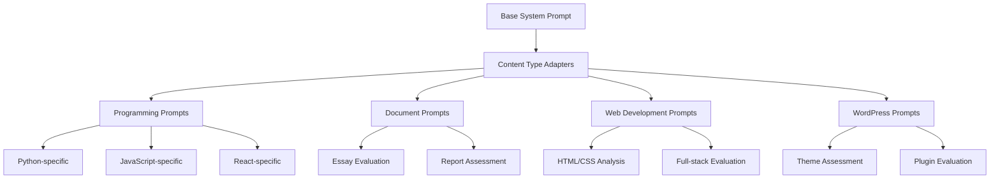

# AI Prompt System Overview

MarkMate's AI grading system relies on sophisticated prompt engineering to ensure consistent, fair, and comprehensive assessment of student submissions across multiple content types and assignment formats.

## Prompt Architecture

### 1. Hierarchical Prompt Structure



### 2. Prompt Components

#### System Prompt (Foundation)
```
You are an expert academic grader with extensive experience in computer science education.
You evaluate student work fairly, consistently, and constructively.

Core Principles:
- Maintain consistent standards across all submissions
- Provide specific, actionable feedback
- Consider both technical correctness and approach quality
- Account for partial credit where appropriate
- Recognize different skill levels and learning progression
```

#### Content-Specific Adapters
- **Programming**: Code quality, algorithm efficiency, style compliance
- **Documentation**: Clarity, completeness, technical accuracy
- **Web Development**: User experience, responsive design, accessibility
- **WordPress**: Theme structure, plugin architecture, best practices

#### Rubric Integration
- **Automatic**: Extract criteria from assignment specifications
- **Manual**: Use provided rubric files
- **Hybrid**: Combine assignment text with custom rubrics

## Prompt Templates

### 1. Programming Assignment Template

```jinja2
{{ system_prompt }}

ASSIGNMENT CONTEXT:
{{ assignment_specification }}


GRADING RUBRIC:
{{ rubric }}


STUDENT SUBMISSION ANALYSIS:

CODE FILES:

File: {{ file.path }}
Language: {{ file.language }}
Content:
```{{ file.language }}
{{ file.content }}
```

Static Analysis:
- Functions: {{ file.analysis.functions|length }}
- Complexity: {{ file.analysis.complexity }}
- Style Issues: {{ file.analysis.style_issues|length }}




GITHUB REPOSITORY ANALYSIS:
- Total Commits: {{ github_analysis.total_commits }}
- Development Span: {{ github_analysis.development_span_days }} days
- Commit Message Quality: {{ github_analysis.commit_message_quality.score }}/100
- Consistency Score: {{ github_analysis.consistency_score }}
- Collaboration Level: {{ github_analysis.collaboration_level }}



DOCUMENTATION:

{{ doc.title }}:
{{ doc.content }}



GRADING INSTRUCTIONS:
1. Evaluate against the provided rubric and assignment requirements
2. Assign a numerical score (0-100)
3. Provide detailed feedback covering:
   - Technical correctness and functionality
   - Code quality and best practices
   - Documentation and comments
   - Version control usage (if applicable)
   - Areas for improvement

Format your response as:
SCORE: [numerical score]
FEEDBACK: [detailed feedback]
```

### 2. Web Development Template

```jinja2
{{ system_prompt }}

ASSIGNMENT CONTEXT:
{{ assignment_specification }}

WEB PROJECT ANALYSIS:

HTML STRUCTURE:

File: {{ file.path }}
Validation: {{ file.validation.is_valid }}
Semantic Score: {{ file.analysis.semantic_score }}
Accessibility Score: {{ file.analysis.accessibility_score }}




CSS STYLING:

File: {{ file.path }}
Properties Used: {{ file.analysis.properties_count }}
Responsive Design: {{ file.analysis.responsive_features }}
Best Practices Score: {{ file.analysis.best_practices_score }}




JAVASCRIPT FUNCTIONALITY:

File: {{ file.path }}
Functions: {{ file.analysis.functions|length }}
Event Handlers: {{ file.analysis.event_handlers|length }}
Error Handling: {{ file.analysis.error_handling_score }}



WEB VALIDATION RESULTS:
- HTML Validation: {{ web_validation.html_valid }}
- CSS Validation: {{ web_validation.css_valid }}
- Accessibility Compliance: {{ web_validation.accessibility_score }}
- Performance Metrics: {{ web_validation.performance_score }}

GRADING INSTRUCTIONS:
Evaluate the web project considering:
1. Technical Implementation (30%)
   - Valid HTML/CSS
   - Functional JavaScript
   - Cross-browser compatibility

2. Design and User Experience (25%)
   - Visual appeal and layout
   - Responsive design
   - User interface quality

3. Code Quality (25%)
   - Clean, organized code
   - Proper commenting
   - Best practices adherence

4. Functionality (20%)
   - Feature completeness
   - User interaction quality
   - Error handling

Provide specific feedback for each category.
```

### 3. WordPress Assignment Template

```jinja2
{{ system_prompt }}

ASSIGNMENT CONTEXT:
{{ assignment_specification }}

WORDPRESS PROJECT ANALYSIS:

THEME ANALYSIS:
- Theme Name: {{ wordpress_content.theme.name }}
- Template Files: {{ wordpress_content.theme.template_files|length }}
- Custom Functions: {{ wordpress_content.theme.functions_analysis.custom_functions }}
- WordPress Standards Compliance: {{ wordpress_content.theme.standards_score }}

PLUGIN ANALYSIS:

- Plugin: {{ plugin.name }}
- Functionality: {{ plugin.description }}
- Code Quality: {{ plugin.quality_score }}


DATABASE CONTENT:
- Posts: {{ wordpress_content.database.posts_count }}
- Pages: {{ wordpress_content.database.pages_count }}
- Custom Post Types: {{ wordpress_content.database.custom_post_types }}
- Media Items: {{ wordpress_content.database.media_count }}

AI INTEGRATION DETECTED:

AI-related plugins found:

- {{ ai_plugin.name }}: {{ ai_plugin.description }}




GRADING INSTRUCTIONS:
Evaluate the WordPress project on:
1. Technical Implementation (35%)
   - Theme structure and organization
   - Plugin functionality
   - WordPress coding standards

2. Content Quality (25%)
   - Post/page content depth
   - Media usage and organization
   - SEO optimization

3. Customization and Innovation (25%)
   - Custom theme elements
   - Unique functionality
   - Creative problem-solving

4. Best Practices (15%)
   - Security considerations
   - Performance optimization
   - Accessibility features

Consider both the static analysis and the overall project scope.
```

## Dynamic Prompt Generation

### 1. Context-Aware Adaptation

The prompt system dynamically adapts based on:
- **Assignment Type**: Programming, web development, documentation
- **Available Content**: Code files, documents, GitHub data
- **Rubric Presence**: Automatic rubric extraction or manual rubric
- **Student Level**: Introductory, intermediate, advanced courses

### 2. Content Integration Logic

```python
def generate_grading_prompt(
    assignment_spec: str,
    student_content: Dict[str, Any],
    rubric: Optional[str] = None,
    assignment_type: str = "auto"
) -> str:
    """Generate context-aware grading prompt."""
    
    # Detect assignment type if not specified
    if assignment_type == "auto":
        assignment_type = detect_assignment_type(assignment_spec, student_content)
    
    # Select base template
    template = get_template_for_type(assignment_type)
    
    # Enrich with available content
    context = {
        "system_prompt": get_system_prompt(),
        "assignment_specification": assignment_spec,
        "rubric": rubric or extract_rubric(assignment_spec),
        **student_content
    }
    
    # Generate final prompt
    return template.render(context)
```

### 3. Multi-Format Content Integration

The system intelligently combines different content types:

```python
# Content prioritization
CONTENT_PRIORITY = {
    "code_files": 1.0,      # Highest priority for programming
    "github_analysis": 0.9,  # High for development process
    "documentation": 0.8,    # Important for understanding
    "web_files": 0.7,       # Context-dependent
    "media_files": 0.3      # Supporting evidence
}

def integrate_content(student_data: Dict[str, Any]) -> Dict[str, Any]:
    """Integrate multiple content types with appropriate weighting."""
    integrated = {}
    
    for content_type, priority in CONTENT_PRIORITY.items():
        if content_type in student_data:
            integrated[content_type] = student_data[content_type]
            integrated[f"{content_type}_priority"] = priority
    
    return integrated
```

## Rubric Integration System

### 1. Automatic Rubric Extraction

```python
def extract_rubric_criteria(assignment_text: str) -> List[RubricCriterion]:
    """Extract grading criteria from assignment specifications."""
    
    criteria_patterns = [
        r"(?i)criteria?:?\s*(.+?)(?=\n\n|\n[A-Z]|$)",
        r"(?i)grading:?\s*(.+?)(?=\n\n|\n[A-Z]|$)",
        r"(?i)evaluation:?\s*(.+?)(?=\n\n|\n[A-Z]|$)",
        r"(?i)requirements?:?\s*(.+?)(?=\n\n|\n[A-Z]|$)"
    ]
    
    extracted_criteria = []
    for pattern in criteria_patterns:
        matches = re.findall(pattern, assignment_text, re.DOTALL)
        for match in matches:
            criteria = parse_criteria_text(match)
            extracted_criteria.extend(criteria)
    
    return deduplicate_criteria(extracted_criteria)
```

### 2. Rubric Format Support

#### Structured Rubric (JSON)
```json
{
  "criteria": [
    {
      "name": "Code Quality",
      "weight": 30,
      "levels": [
        {"name": "Excellent", "score": 90-100, "description": "..."},
        {"name": "Good", "score": 80-89, "description": "..."},
        {"name": "Satisfactory", "score": 70-79, "description": "..."},
        {"name": "Needs Improvement", "score": 0-69, "description": "..."}
      ]
    }
  ]
}
```

#### Text-Based Rubric
```
GRADING RUBRIC:

Code Quality (30%):
- Excellent (90-100): Clean, well-organized code following best practices
- Good (80-89): Mostly clean code with minor style issues
- Satisfactory (70-79): Functional code with some organization issues
- Needs Improvement (0-69): Poorly organized or non-functional code

Functionality (40%):
- Excellent (90-100): All requirements met, handles edge cases
- Good (80-89): Most requirements met, minor functionality gaps
- Satisfactory (70-79): Basic requirements met
- Needs Improvement (0-69): Major functionality missing or broken
```

## Feedback Quality Control

### 1. Feedback Templates

#### Constructive Feedback Structure
```
STRENGTHS:
- Identify what the student did well
- Highlight specific positive aspects
- Recognize good problem-solving approaches

AREAS FOR IMPROVEMENT:
- Specific, actionable suggestions
- Link to relevant resources or examples
- Prioritize most impactful changes

TECHNICAL NOTES:
- Code-specific observations
- Best practice recommendations
- Performance or security considerations

OVERALL ASSESSMENT:
- Summary of submission quality
- Learning progression indicators
- Encouragement and next steps
```

### 2. Consistency Enforcement

```python
class FeedbackValidator:
    def validate_feedback(self, feedback: str, score: float) -> ValidationResult:
        """Ensure feedback quality and consistency."""
        
        checks = [
            self.check_feedback_length(feedback),
            self.check_score_alignment(feedback, score),
            self.check_specificity(feedback),
            self.check_constructiveness(feedback),
            self.check_technical_accuracy(feedback)
        ]
        
        return ValidationResult(checks)
    
    def check_score_alignment(self, feedback: str, score: float) -> bool:
        """Verify feedback tone matches numerical score."""
        if score >= 90 and any(word in feedback.lower() for word in ["poor", "inadequate", "fails"]):
            return False
        if score <= 60 and any(word in feedback.lower() for word in ["excellent", "outstanding", "perfect"]):
            return False
        return True
```

## Multi-Provider Prompt Consistency

### 1. Provider-Specific Adaptations

Different AI providers may require slight prompt modifications:

```python
PROVIDER_ADAPTATIONS = {
    "anthropic": {
        "style": "analytical",
        "format_preference": "structured",
        "max_tokens": 4000
    },
    "openai": {
        "style": "conversational", 
        "format_preference": "markdown",
        "max_tokens": 3000
    },
    "gemini": {
        "style": "detailed",
        "format_preference": "sections",
        "max_tokens": 2000
    }
}
```

### 2. Response Standardization

```python
def standardize_grading_response(
    raw_response: str, 
    provider: str
) -> GradingResponse:
    """Standardize AI responses across providers."""
    
    # Extract score using multiple patterns
    score = extract_score(raw_response)
    
    # Extract feedback sections
    feedback_sections = parse_feedback_sections(raw_response)
    
    # Validate and normalize
    validated_score = validate_score_range(score)
    structured_feedback = structure_feedback(feedback_sections)
    
    return GradingResponse(
        score=validated_score,
        feedback=structured_feedback,
        provider=provider,
        confidence=calculate_confidence(raw_response)
    )
```

## Continuous Improvement

### 1. Prompt Performance Monitoring

```python
class PromptAnalytics:
    def track_prompt_performance(
        self, 
        prompt_version: str,
        assignment_type: str,
        grading_results: List[GradingResult]
    ):
        """Monitor prompt effectiveness."""
        
        metrics = {
            "consistency": calculate_inter_grader_consistency(grading_results),
            "feedback_quality": assess_feedback_quality(grading_results),
            "score_distribution": analyze_score_distribution(grading_results),
            "processing_time": calculate_avg_processing_time(grading_results)
        }
        
        self.store_metrics(prompt_version, assignment_type, metrics)
```

### 2. Adaptive Prompt Optimization

- **A/B Testing**: Compare prompt variations on sample submissions
- **Feedback Analysis**: Incorporate instructor feedback on AI assessments
- **Performance Metrics**: Monitor consistency and accuracy over time
- **Version Control**: Track prompt changes and their impact

---

**Related Documentation**:
- [Custom Prompt Development](custom-prompts.md)
- [LLM Provider Configuration](llm-providers.md)
- [Grading Configuration](../configuration/grading-config.md)