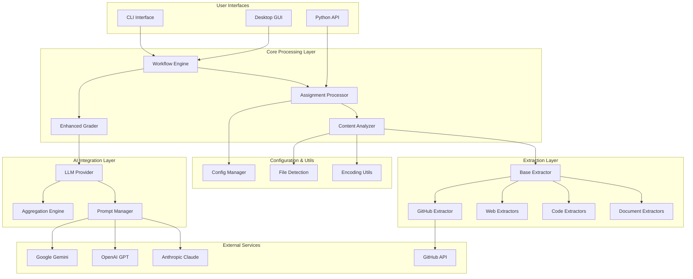
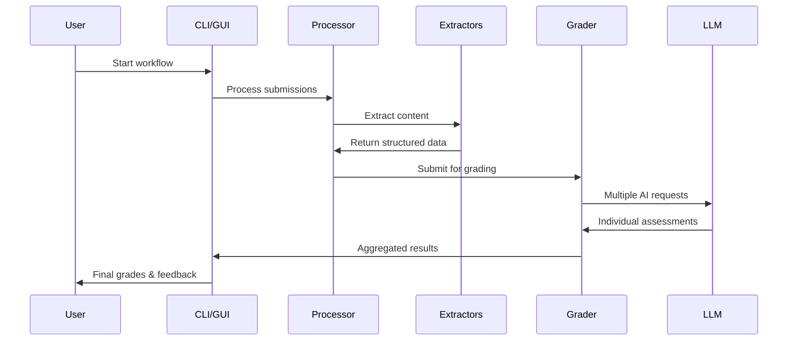

# MarkMate Architecture Overview

MarkMate is designed with a modular, extensible architecture that separates concerns between data processing, AI integration, and user interfaces while maintaining code reusability and testability.

## High-Level Architecture



## Core Components

### 1. User Interface Layer

#### CLI Interface (`src/mark_mate/cli/`)
- **Purpose**: Command-line access to all MarkMate functionality
- **Components**:
  - `main.py`: Entry point and command routing
  - `consolidate.py`: File organization commands
  - `scan.py`: GitHub URL discovery
  - `extract.py`: Content extraction orchestration
  - `grade.py`: AI grading commands
  - `generate_config.py`: Configuration management

#### Desktop GUI (`src/mark_mate/gui/`)
- **Purpose**: Cross-platform desktop application
- **Framework**: Flet (Flutter-based)
- **Components**:
  - `main.py`: Application entry point and window management
  - `pages/`: Individual workflow pages (consolidate, scan, extract, grade, config)
  - `components/`: Reusable UI components (navigation, header)
  - `adapters/`: CLI-GUI bridge layer
  - `utils/`: GUI-specific utilities (async runners, progress tracking)

#### Python API (`src/mark_mate/`)
- **Purpose**: Programmatic access for integration
- **Design**: Direct class imports and method calls
- **Target Users**: Developers, educational platforms, batch processing

### 2. Core Processing Layer

#### Workflow Engine
```python
# Conceptual workflow coordination
class WorkflowEngine:
    def __init__(self):
        self.processor = AssignmentProcessor()
        self.grader = EnhancedGradingSystem()
        
    def run_complete_workflow(self, config):
        # Orchestrates: consolidate → scan → extract → grade
        pass
```

#### Assignment Processor (`src/mark_mate/core/processor.py`)
- **Purpose**: Coordinates content extraction and analysis
- **Responsibilities**:
  - Manages extraction pipeline
  - Handles multiple file formats
  - Coordinates GitHub integration
  - Maintains processing metadata

#### Enhanced Grader (`src/mark_mate/core/enhanced_grader.py`)
- **Purpose**: AI-powered grading with statistical aggregation
- **Features**:
  - Multi-provider coordination
  - Statistical result aggregation
  - Confidence scoring
  - Cost tracking and limits

#### Content Analyzer (`src/mark_mate/core/analyzer.py`)
- **Purpose**: High-level content analysis and summarization
- **Functions**:
  - Cross-format content integration
  - Metadata enrichment
  - Quality assessment
  - Summary generation

### 3. Extraction Layer

#### Base Extractor Pattern (`src/mark_mate/extractors/base_extractor.py`)
```python
class BaseExtractor:
    def can_handle(self, file_path: str) -> bool:
        """Determine if this extractor can process the file."""
        pass
    
    def extract(self, file_path: str) -> Dict[str, Any]:
        """Extract content and metadata from the file.""" 
        pass
    
    def get_supported_formats(self) -> List[str]:
        """Return list of supported file extensions."""
        pass
```

#### Specialized Extractors
- **Document Extractors** (`office_extractor.py`):
  - PDF processing with text and metadata extraction
  - DOCX document analysis
  - PowerPoint presentation content
  - Excel spreadsheet data

- **Code Extractors** (`code_extractor.py`, `react_extractor.py`):
  - Python code analysis with AST parsing
  - JavaScript/TypeScript processing
  - React component analysis
  - Package.json and dependency analysis

- **Web Extractors** (`web_extractor.py`):
  - HTML structure and content analysis
  - CSS styling evaluation
  - JavaScript functionality assessment
  - Web validation and accessibility

- **GitHub Extractor** (`github_extractor.py`):
  - Repository metadata collection
  - Commit history analysis
  - Development pattern assessment
  - Collaboration metrics

### 4. AI Integration Layer

#### LLM Provider (`src/mark_mate/core/llm_provider.py`)
- **Purpose**: Unified interface to multiple AI providers
- **Architecture**:
  ```python
  class LLMProvider:
      def __init__(self, config: GradingConfig):
          self.providers = {
              "anthropic": AnthropicProvider(),
              "openai": OpenAIProvider(), 
              "gemini": GeminiProvider()
          }
      
      async def grade_submission(self, provider: str, prompt: str) -> GradingResult:
          """Route to appropriate provider."""
          pass
  ```

#### Prompt Manager (`src/mark_mate/core/prompt_manager.py`)
- **Purpose**: Centralized prompt template management
- **Features**:
  - Template-based prompt generation
  - Rubric integration
  - Context-aware prompt adaptation
  - Multi-format support

#### Aggregation Engine
- **Purpose**: Statistical aggregation of multiple AI assessments
- **Methods**:
  - Weighted averaging
  - Median calculation
  - Trimmed mean
  - Confidence scoring
  - Outlier detection

## Data Flow Architecture

### 1. Processing Pipeline


### 2. Data Models

#### Submission Data Model
```python
@dataclass
class SubmissionData:
    student_id: str
    content: Dict[str, Any]
    metadata: Dict[str, Any]
    github_analysis: Optional[Dict[str, Any]]
    extraction_timestamp: datetime
    
class ContentData:
    documents: List[DocumentContent]
    code_files: List[CodeContent]
    web_files: List[WebContent]
    github_data: Optional[GitHubContent]
```

#### Grading Data Model
```python
@dataclass
class GradingResult:
    student_id: str
    aggregate_score: float
    confidence: float
    feedback: str
    individual_assessments: List[IndividualAssessment]
    statistics: Dict[str, float]
    
@dataclass
class IndividualAssessment:
    provider: str
    model: str
    score: float
    feedback: str
    processing_time: float
```

## Extensibility Design

### 1. Plugin Architecture

#### Custom Extractors
```python
# Example custom extractor
class CustomExtractor(BaseExtractor):
    def can_handle(self, file_path: str) -> bool:
        return file_path.endswith('.custom')
    
    def extract(self, file_path: str) -> Dict[str, Any]:
        # Custom extraction logic
        return {"content": "...", "metadata": "..."}

# Registration
register_extractor(CustomExtractor())
```

#### Custom Analyzers
```python
class CustomAnalyzer:
    def analyze(self, content: Dict[str, Any]) -> Dict[str, Any]:
        # Custom analysis logic
        pass

# Integration point
analyzer_registry.register("custom", CustomAnalyzer())
```

### 2. Configuration Extension Points

#### Custom Grading Providers
```python
class CustomLLMProvider(BaseLLMProvider):
    def grade(self, prompt: str, content: str) -> GradingResult:
        # Custom LLM integration
        pass
```

#### Custom Prompt Templates
```yaml
# Custom prompt configuration
prompts:
  custom_template:
    system: "Custom system prompt..."
    user: "Custom user prompt template..."
    variables: ["content", "rubric", "metadata"]
```

## Performance Architecture

### 1. Async Processing
- **GUI**: Non-blocking operations with progress tracking
- **Batch Processing**: Concurrent submission processing
- **AI Requests**: Parallel LLM calls with rate limiting

### 2. Memory Management
- **Streaming**: Large file processing without full memory load
- **Lazy Loading**: Extract content only when needed
- **Cleanup**: Automatic temporary file cleanup

### 3. Caching Strategy
- **Extraction Cache**: Avoid re-processing unchanged files
- **AI Response Cache**: Cache expensive LLM calls
- **Configuration Cache**: In-memory config caching

## Security Architecture

### 1. API Key Management
- **Environment Variables**: Secure key storage
- **Key Rotation**: Support for key updates
- **Scope Limitation**: Minimal required permissions

### 2. Input Validation
- **File Type Validation**: Prevent malicious file processing
- **Size Limits**: Prevent resource exhaustion
- **Content Sanitization**: Safe text processing

### 3. Network Security
- **HTTPS Only**: Encrypted API communications
- **Timeout Controls**: Prevent hanging requests
- **Rate Limiting**: Respect provider limits

## Testing Architecture

### 1. Unit Testing
- **Component Isolation**: Mock external dependencies
- **Extractor Testing**: Format-specific test suites
- **AI Provider Mocking**: Simulate LLM responses

### 2. Integration Testing
- **Workflow Testing**: End-to-end pipeline validation
- **Multi-format Testing**: Combined content processing
- **Error Handling**: Failure scenario testing

### 3. Performance Testing
- **Load Testing**: Large batch processing
- **Memory Profiling**: Resource usage monitoring
- **Latency Testing**: Response time validation

## Deployment Architecture

### 1. Package Distribution
- **PyPI**: Standard Python package distribution
- **Dependencies**: Minimal required dependencies
- **Optional Components**: GUI framework as optional

### 2. Cross-Platform Support
- **CLI**: Pure Python compatibility
- **GUI**: Flet framework cross-platform support
- **Native Features**: OS-specific optimizations

### 3. Integration Points
- **LMS Integration**: Canvas, Moodle, Blackboard APIs
- **CI/CD**: GitHub Actions, automated grading
- **Educational Platforms**: Custom API endpoints

---

**Related Documentation**:
- [GUI Framework Design](gui-design.md)
- [API Documentation](api.md)
- [Extending MarkMate](../advanced/extending.md)