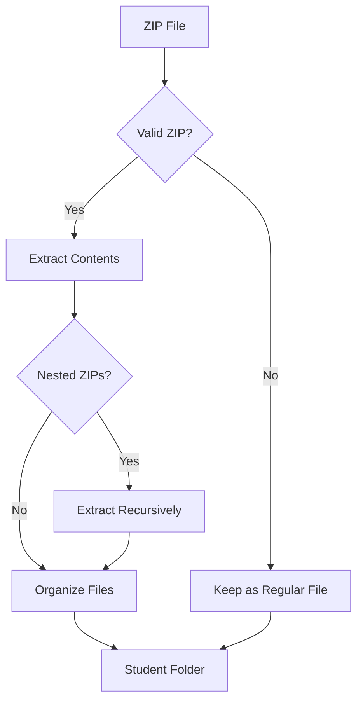

# Consolidate Phase - File Organization

The consolidate phase transforms raw, unstructured student submissions into an organized directory structure that enables systematic processing.

## Overview

The consolidate command processes raw submission files and organizes them by student ID, extracting archives and filtering unnecessary files.

## Core Functions

### 1. Student ID Extraction
MarkMate uses intelligent pattern matching to identify student IDs from filenames and folder names.

**Supported Patterns**:
- `123_assignment.zip` → Student ID: `123`
- `john_doe_456_project.pdf` → Student ID: `456`
- `submission_789.docx` → Student ID: `789`
- `folder_999/` → Student ID: `999`

**Pattern Matching Logic**:
```python
# Primary pattern: 3-digit numbers
pattern = r"_?(\d{3})_?"

# Examples:
"student_123_assignment.zip" → "123"
"123_final_project.zip" → "123"
"assignment_456.pdf" → "456"
```

### 2. Archive Extraction
Automatically processes ZIP files while handling common issues.

**Extraction Features**:
- **Nested ZIP Support**: Handles ZIP files within ZIP files
- **Encoding Support**: Handles international filenames in archives
- **Conflict Resolution**: Manages duplicate filenames
- **Structure Preservation**: Maintains logical folder hierarchy

**Extraction Process**:


### 3. File Filtering
Removes system files and artifacts that interfere with processing.

**Default Filters**:
- `.DS_Store` (macOS metadata)
- `__MACOSX/` (macOS archive artifacts)
- `.Spotlight-V100/` (macOS indexing)
- `Thumbs.db` (Windows thumbnails)
- `.Trashes/` (macOS trash folders)

**Filter Configuration**:
```bash
# Keep Mac files (disable filtering)
mark-mate consolidate submissions/ --keep-mac-files

# Custom output directory
mark-mate consolidate submissions/ --output-dir organized/
```

## Processing Options

### Standard Processing
```bash
mark-mate consolidate raw_submissions/
```
**Default Behavior**:
- Extract all ZIP files
- Filter Mac system files
- Group by student ID
- Create `processed_submissions/` directory

### WordPress Mode
```bash
mark-mate consolidate wordpress_submissions/ --wordpress
```
**WordPress-Specific Processing**:
- Recognizes UpdraftPlus backup structure
- Preserves WordPress file hierarchy
- Handles wp-content organization
- Maintains plugin/theme structure

### ZIP Handling Options
```bash
# Discard ZIP files after extraction
mark-mate consolidate submissions/ --no-zip

# Keep original ZIP files
mark-mate consolidate submissions/  # (default behavior)
```

## Output Structure

### Standard Output
```
processed_submissions/
├── 123/
│   ├── main.py
│   ├── requirements.txt
│   └── README.md
├── 456/
│   ├── assignment.pdf
│   └── supporting_docs/
│       └── references.txt
└── 789/
    ├── index.html
    ├── style.css
    └── script.js
```

### WordPress Output
```
processed_submissions/
├── 123/
│   ├── wp-content/
│   │   ├── themes/
│   │   │   └── custom-theme/
│   │   └── plugins/
│   │       └── custom-plugin/
│   └── wp-config.php
└── 456/
    ├── backup-files/
    └── database.sql
```

## GUI Interface

### File Selection
1. **Browse Button**: Select raw submissions folder
2. **Auto-Population**: Output directory automatically suggested
3. **Visual Feedback**: Real-time folder validation

### Processing Options
- ☐ **Discard ZIP files**: Remove archives after extraction
- ☐ **WordPress mode**: Enable WordPress-specific processing
- ☐ **Keep Mac files**: Preserve system files

### Progress Tracking
- **Progress Bar**: Visual indication of processing status
- **Status Updates**: Real-time processing messages
- **Error Handling**: Clear error messages and recovery suggestions

## Common Issues and Solutions

### Issue: Student ID Not Detected
**Symptoms**: Files not grouped properly
**Solutions**:
1. Rename files to include clear student IDs
2. Use pattern: `studentID_filename.ext`
3. Check for 3-digit ID patterns

**Example Fix**:
```bash
# Before
john_doe_assignment.zip

# After  
john_doe_123_assignment.zip
```

### Issue: Corrupted ZIP Files
**Symptoms**: Extraction failures, incomplete processing
**Solutions**:
1. Re-download original submissions
2. Use `--no-zip` to skip problematic archives
3. Manually extract and reprocess

### Issue: Encoding Problems
**Symptoms**: Garbled filenames, extraction errors
**Solutions**:
1. Check original submission encoding
2. Use international-friendly submission guidelines
3. Contact students for resubmission

### Issue: Nested Directory Chaos
**Symptoms**: Deeply nested unnecessary folders
**Solutions**:
1. Manual reorganization after consolidation
2. Update submission guidelines for students
3. Use custom processing scripts

## Validation Checklist

After consolidation, verify:

- [ ] **Student ID Recognition**: All submissions properly grouped
- [ ] **File Extraction**: ZIP contents accessible
- [ ] **Structure Integrity**: Logical folder organization
- [ ] **Content Preservation**: No missing files
- [ ] **Size Validation**: Reasonable file sizes
- [ ] **Format Support**: All expected file types present

## Advanced Configuration

### Custom Output Directory
```bash
mark-mate consolidate submissions/ --output-dir custom_location/
```

### Processing Large Batches
```bash
# For large numbers of submissions
mark-mate consolidate submissions/ --output-dir batch_1/
mark-mate consolidate more_submissions/ --output-dir batch_2/
```

### Integration with Batch Scripts
```bash
#!/bin/bash
# Batch processing script
for folder in submission_batch_*; do
    mark-mate consolidate "$folder" --output-dir "processed_$folder"
done
```

## Performance Considerations

### Speed Optimization
- **SSD Storage**: Use fast storage for large batches
- **Memory**: Ensure adequate RAM for large ZIP files
- **Parallel Processing**: Process multiple batches separately

### Size Limitations
- **Individual Files**: Generally no limit (system dependent)
- **ZIP Archives**: Limited by available memory
- **Total Batch**: Scales with storage capacity

## Next Steps

After successful consolidation:

1. **[Scan Phase](scan.md)**: Discover GitHub repository URLs
2. **[Extract Phase](extract.md)**: Process content for grading
3. **Quality Review**: Manually verify organization

## CLI Reference

```bash
mark-mate consolidate [OPTIONS] FOLDER_PATH

Options:
  --no-zip              Discard zip files instead of extracting
  --wordpress           Enable WordPress-specific processing  
  --keep-mac-files      Preserve Mac system files
  --output-dir TEXT     Output directory (default: processed_submissions)
  --help                Show this message and exit
```

---

**Related Documentation**:
- [Workflow Overview](overview.md)
- [Scan Phase](scan.md)
- [GUI Quick Start](../getting-started/quickstart.md)