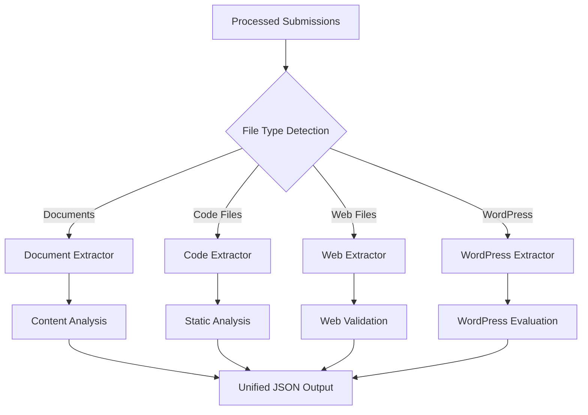

# Extract Phase - Content Processing

The extract phase processes consolidated submissions and optional GitHub repositories to create a comprehensive JSON dataset ready for AI grading.

## Overview

The extract command analyzes multiple file formats, extracts content and metadata, and optionally integrates GitHub repository analysis to create a unified dataset for each student.

## Core Extraction Capabilities

### 1. Document Processing
- **PDF Files**: Text extraction, metadata analysis, page count
- **DOCX Documents**: Content, styling, embedded media
- **Text Files**: Markdown, plain text, README files
- **Presentations**: PowerPoint content and structure

### 2. Code Analysis
- **Python**: AST parsing, function analysis, style checking
- **JavaScript/TypeScript**: Syntax trees, dependency analysis
- **React Components**: JSX structure, prop interfaces, hooks usage
- **Web Files**: HTML validation, CSS properties, responsive design

### 3. GitHub Integration
- **Repository Metadata**: Stars, forks, language breakdown
- **Commit Analysis**: History, message quality, development patterns
- **Collaboration Metrics**: Multiple contributors, team coordination
- **Code Quality**: Repository structure, documentation presence

### 4. WordPress Projects
- **Theme Analysis**: Template files, custom functions, standards compliance
- **Plugin Evaluation**: Functionality, code quality, best practices
- **Database Content**: Posts, pages, custom post types, media
- **AI Integration Detection**: AI-related plugins and features

## Extraction Process

### 1. File Discovery and Classification


### 2. Multi-Format Content Integration
Each student's data is structured as:

```json
{
  "student_id": "123",
  "extraction_timestamp": "2025-01-23T14:30:00Z",
  "content": {
    "documents": [...],
    "code_files": [...],
    "web_files": [...],
    "wordpress_content": {...}
  },
  "metadata": {
    "file_count": 15,
    "total_size_bytes": 2048576,
    "formats_detected": ["py", "md", "pdf"],
    "encoding_issues": []
  },
  "github_analysis": {
    "repository_url": "https://github.com/student/project",
    "commit_history": [...],
    "development_metrics": {...}
  }
}
```

## Command Usage

### Basic Extraction
```bash
# Extract from processed submissions
mark-mate extract processed_submissions/

# Custom output location
mark-mate extract processed_submissions/ --output my_content.json
```

### With GitHub Integration
```bash
# First, scan for GitHub URLs
mark-mate scan processed_submissions/ --output github_urls.txt

# Extract with GitHub analysis
mark-mate extract processed_submissions/ --github-urls github_urls.txt
```

### WordPress Mode
```bash
# WordPress-specific extraction
mark-mate extract processed_submissions/ --wordpress
```

### Advanced Options
```bash
# Dry run (preview without extraction)
mark-mate extract processed_submissions/ --dry-run

# Limit processing for testing
mark-mate extract processed_submissions/ --max-students 5

# Combine all options
mark-mate extract processed_submissions/ \
  --github-urls github_urls.txt \
  --wordpress \
  --output detailed_extraction.json \
  --max-students 10
```

## GUI Interface

### File Selection
1. **Processed Submissions Folder**: Browse and select consolidated submissions
2. **Output File**: Specify JSON output location (auto-populated)
3. **GitHub URLs File**: Optional file with student:URL mappings
4. **WordPress Mode**: Enable WordPress-specific processing

### Processing Options
- ☐ **WordPress Processing**: Enable WordPress theme/plugin analysis
- ☐ **Dry Run**: Preview extraction without processing
- **Max Students**: Limit for testing (leave empty for all)

### Progress Tracking
- **Progress Bar**: Visual extraction progress
- **Status Updates**: Current file being processed
- **Results Summary**: Statistics on successful extractions

## Content Analysis Details

### Document Extraction
```python
# Example document content structure
{
  "type": "pdf",
  "path": "student_123/assignment.pdf",
  "content": "Full text content...",
  "metadata": {
    "page_count": 5,
    "author": "Student Name",
    "creation_date": "2025-01-20",
    "word_count": 1250,
    "language": "en"
  },
  "analysis": {
    "readability_score": 8.2,
    "academic_level": "undergraduate",
    "citation_count": 12
  }
}
```

### Code Analysis
```python
# Example Python code analysis
{
  "type": "python",
  "path": "student_123/main.py",
  "content": "Python source code...",
  "analysis": {
    "functions": [
      {
        "name": "calculate_average",
        "line_start": 10,
        "line_end": 18,
        "complexity": 3,
        "docstring": "Calculates the average of a list of numbers"
      }
    ],
    "imports": ["math", "sys", "numpy"],
    "classes": [],
    "style_issues": [
      {
        "line": 25,
        "issue": "line too long",
        "severity": "warning"
      }
    ],
    "metrics": {
      "lines_of_code": 120,
      "cyclomatic_complexity": 8,
      "maintainability_index": 85
    }
  }
}
```

### Web Development Analysis
```python
# Example web file analysis
{
  "html_files": [
    {
      "path": "student_123/index.html",
      "validation": {
        "is_valid": true,
        "errors": [],
        "warnings": ["Missing alt attribute on image"]
      },
      "analysis": {
        "semantic_score": 92,
        "accessibility_score": 88,
        "element_count": 45,
        "heading_structure": ["h1", "h2", "h3"],
        "form_elements": 3
      }
    }
  ],
  "css_files": [
    {
      "path": "student_123/style.css",
      "analysis": {
        "properties_count": 156,
        "responsive_features": ["@media queries", "flexbox"],
        "best_practices_score": 78,
        "unused_rules": 5
      }
    }
  ]
}
```

### GitHub Repository Analysis
```python
# Example GitHub analysis
{
  "repository_url": "https://github.com/student123/project",
  "metadata": {
    "stars": 2,
    "forks": 0,
    "language": "Python",
    "size_kb": 245,
    "creation_date": "2025-01-15",
    "last_push": "2025-01-22"
  },
  "commit_analysis": {
    "total_commits": 15,
    "development_span_days": 7,
    "commit_frequency": "regular",
    "message_quality": {
      "score": 85,
      "quality_level": "good",
      "descriptive_messages": 12,
      "generic_messages": 3
    }
  },
  "development_pattern": {
    "consistency_score": 0.82,
    "collaboration_level": "individual",
    "late_commits": 2,
    "steady_development": true
  }
}
```

## Encoding and International Support

### Multi-Encoding Detection
MarkMate automatically handles international submissions:

```python
# Encoding detection sequence
ENCODING_PRIORITY = [
    'utf-8',        # Modern standard
    'utf-16',       # Windows international
    'cp1252',       # Windows Western European
    'latin1',       # European legacy
    'cp1251',       # Cyrillic
    'shift_jis',    # Japanese
    'euc-kr',       # Korean
    'gb2312',       # Chinese Simplified
    'big5'          # Chinese Traditional
]
```

### Encoding Issue Handling
- **Automatic Detection**: Try multiple encodings per file
- **Graceful Fallback**: Use best available encoding
- **Error Reporting**: Log encoding issues for review
- **Character Preservation**: Maintain international characters

## Quality Control and Validation

### Extraction Validation
```python
# Post-extraction validation
def validate_extraction(student_data):
    checks = [
        check_content_completeness(student_data),
        validate_file_processing(student_data),
        verify_metadata_accuracy(student_data),
        assess_analysis_quality(student_data)
    ]
    return ValidationReport(checks)
```

### Content Quality Metrics
- **Processing Success Rate**: Percentage of files successfully processed
- **Content Completeness**: All expected content types extracted
- **Analysis Depth**: Comprehensive metadata and analysis
- **Error Rate**: Minimal encoding or processing errors

## Performance Optimization

### Parallel Processing
```bash
# MarkMate automatically uses parallel processing for:
# - Multiple students simultaneously
# - Different file types per student
# - GitHub API calls
# - Content analysis operations
```

### Memory Management
- **Streaming**: Process large files without loading into memory
- **Cleanup**: Automatic temporary file cleanup
- **Batching**: Process students in manageable groups

### Caching Strategy
- **File Content**: Cache processed content to avoid reprocessing
- **GitHub Data**: Cache repository analysis for repeated runs
- **Analysis Results**: Cache expensive analysis operations

## Error Handling and Recovery

### Common Issues and Solutions

#### Issue: File Access Errors
**Symptoms**: Permission denied, file not found
**Solutions**:
```bash
# Check file permissions
ls -la processed_submissions/

# Verify folder structure
mark-mate extract processed_submissions/ --dry-run
```

#### Issue: Encoding Problems
**Symptoms**: Garbled text, extraction failures
**Solutions**:
- International students often use different encodings
- MarkMate automatically tries multiple encodings
- Check extraction logs for encoding issues

#### Issue: GitHub API Limits
**Symptoms**: GitHub analysis fails for some students
**Solutions**:
- Set GITHUB_TOKEN environment variable for higher limits
- Process in smaller batches
- Use --max-students for testing

#### Issue: Large File Processing
**Symptoms**: Memory errors, slow processing
**Solutions**:
```bash
# Process in smaller batches
mark-mate extract processed_submissions/ --max-students 20

# Monitor system resources
# Consider upgrading memory for large classes
```

## Integration with Next Phase

### Preparing for Grading
After successful extraction:

1. **Review Output**: Check `extracted_content.json` completeness
2. **Validate Content**: Ensure all expected students are present
3. **Prepare Assignment Spec**: Create detailed grading criteria
4. **Configure Grading**: Set up appropriate AI grading configuration

### Output File Usage
```bash
# The extracted content becomes input for grading
mark-mate grade extracted_content.json assignment_specification.txt

# Use with custom configuration
mark-mate grade extracted_content.json assignment_spec.txt --config grading_config.yaml
```

## Advanced Features

### Custom Extraction Patterns
```python
# Extend extraction for custom file types
class CustomExtractor(BaseExtractor):
    def can_handle(self, file_path: str) -> bool:
        return file_path.endswith('.custom')
    
    def extract(self, file_path: str) -> Dict[str, Any]:
        # Custom extraction logic
        return {"content": "...", "metadata": "..."}
```

### Batch Processing Scripts
```bash
#!/bin/bash
# Process multiple assignment batches
for assignment in assignment_*; do
    echo "Processing $assignment..."
    mark-mate extract "processed_$assignment" \
      --output "${assignment}_content.json" \
      --github-urls "${assignment}_urls.txt"
done
```

## CLI Reference

```bash
mark-mate extract [OPTIONS] SUBMISSIONS_FOLDER

Options:
  --output TEXT         Output JSON file (default: extracted_content.json)
  --wordpress           Enable WordPress processing
  --github-urls TEXT    GitHub URL mapping file
  --dry-run             Preview processing without extraction
  --max-students INT    Limit number of students (for testing)
  --help                Show this message and exit
```

---

**Related Documentation**:
- [Consolidate Phase](consolidate.md)
- [Grade Phase](grade.md) 
- [GitHub Integration](../examples/github-integration.md)
- [WordPress Projects](../examples/wordpress.md)