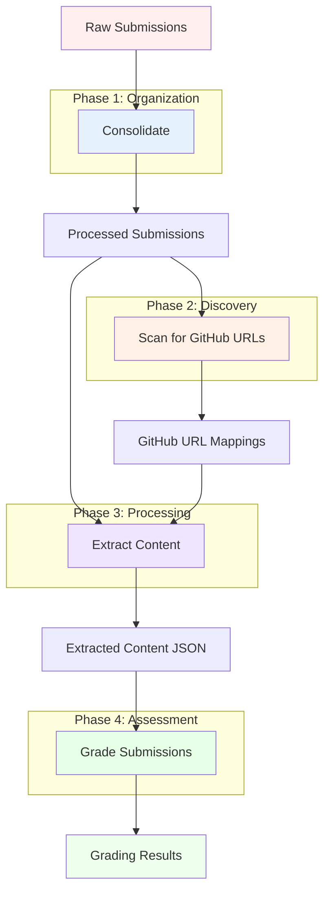

# MarkMate Workflow Overview

The MarkMate workflow consists of four main phases that transform raw student submissions into comprehensive AI-powered grades and feedback.

## Complete Workflow Diagram



## Phase Overview

### 1. Consolidate Phase
**Purpose**: Organize and standardize submission structure
- **Input**: Raw submission files and folders
- **Output**: Organized directory structure by student ID
- **Key Actions**:
  - Extract ZIP archives
  - Group files by student ID
  - Filter system files (.DS_Store, __MACOSX)
  - Handle duplicate files
  - WordPress-specific organization

### 2. Scan Phase (Optional)
**Purpose**: Discover GitHub repository URLs
- **Input**: Processed submissions
- **Output**: Student ID to GitHub URL mappings
- **Key Actions**:
  - Text file scanning with regex patterns
  - ZIP archive content scanning
  - Multiple encoding support
  - Manual URL correction support

### 3. Extract Phase
**Purpose**: Extract and analyze content from all sources
- **Input**: Processed submissions + GitHub URLs (optional)
- **Output**: Comprehensive JSON with all student content
- **Key Actions**:
  - Document processing (PDF, DOCX, TXT, MD)
  - Code analysis (Python, JS, React, TypeScript)
  - GitHub repository analysis
  - WordPress project evaluation
  - International encoding handling

### 4. Grade Phase
**Purpose**: AI-powered assessment and feedback generation
- **Input**: Extracted content JSON + Assignment specification
- **Output**: Detailed grading results with feedback
- **Key Actions**:
  - Multi-LLM assessment (Claude, GPT-4o, Gemini)
  - Statistical aggregation
  - Confidence scoring
  - Detailed feedback generation
  - Rubric-based evaluation

## Workflow Variations

### Linear Workflow (Recommended)
Most comprehensive approach following all four phases:
```
Raw Submissions → Consolidate → Scan → Extract → Grade
```

### Minimal Workflow
For submissions without GitHub repositories:
```
Raw Submissions → Consolidate → Extract → Grade
```

### Document-Only Workflow
For pure document submissions:
```
Raw Submissions → Consolidate → Extract (docs only) → Grade
```

### GitHub-Heavy Workflow
For primarily code-based assignments:
```
Raw Submissions → Consolidate → Scan → Extract (with GitHub focus) → Grade
```

## Data Flow

### File Structure Evolution

**Initial State (Raw Submissions)**:
```
submissions/
├── john_doe_assignment.zip
├── jane_smith_submission.pdf
├── 123_project.zip
└── submission_456.docx
```

**After Consolidate**:
```
processed_submissions/
├── 123/
│   ├── project_files/
│   └── README.md
├── 456/
│   └── submission.docx
└── github_urls.txt (if URLs found)
```

**After Extract**:
```
extracted_content.json
{
  "123": {
    "content": {...},
    "metadata": {...},
    "github_analysis": {...}
  },
  "456": {
    "content": {...},
    "metadata": {...}
  }
}
```

**After Grade**:
```
grading_results.json
{
  "123": {
    "aggregate": {
      "mark": 87.5,
      "feedback": "...",
      "confidence": 0.92
    },
    "grader_results": {...}
  }
}
```

## Quality Control Points

### 1. Post-Consolidate Validation
- Verify student ID extraction
- Check for missing submissions
- Validate file structure

### 2. Post-Scan Verification
- Review GitHub URL mappings
- Correct invalid URLs
- Add missing repositories manually

### 3. Pre-Grade Preparation
- Validate extracted content completeness
- Review assignment specification
- Configure grading parameters

### 4. Post-Grade Review
- Analyze confidence scores
- Review outlier grades
- Validate feedback quality

## Common Workflow Decisions

### When to Skip Scan Phase
- Document-only assignments
- No GitHub repositories expected
- URLs provided separately

### When to Use WordPress Mode
- WordPress theme/plugin assignments
- UpdraftPlus backup submissions
- Website development projects

### When to Use Dry Run
- Testing extraction configuration
- Previewing grading parameters
- Validating workflow setup

### When to Limit Students
- Testing new configurations
- Resource-constrained environments
- Iterative grading approach

## Best Practices

### File Organization
1. **Consistent Naming**: Use student IDs in submission names
2. **Clean Structure**: Remove unnecessary nested folders
3. **Archive Handling**: Extract archives for better processing

### GitHub Integration
1. **URL Validation**: Manually verify complex repository structures
2. **Access Permissions**: Ensure repositories are public or accessible
3. **Branch Selection**: Document primary development branch

### Content Extraction
1. **Format Support**: Test with sample files from each format
2. **Encoding Issues**: Preview with international student samples
3. **Size Limits**: Monitor extraction performance with large files

### Grading Configuration
1. **Rubric Alignment**: Ensure AI prompts match assignment criteria
2. **Multiple Runs**: Use statistical aggregation for consistency
3. **Cost Management**: Set appropriate budget limits

---

**Next Steps**: 
- [Consolidate Phase Details](consolidate.md)
- [Configuration Guide](../configuration/grading-config.md)
- [GUI Tutorial](../getting-started/quickstart.md)