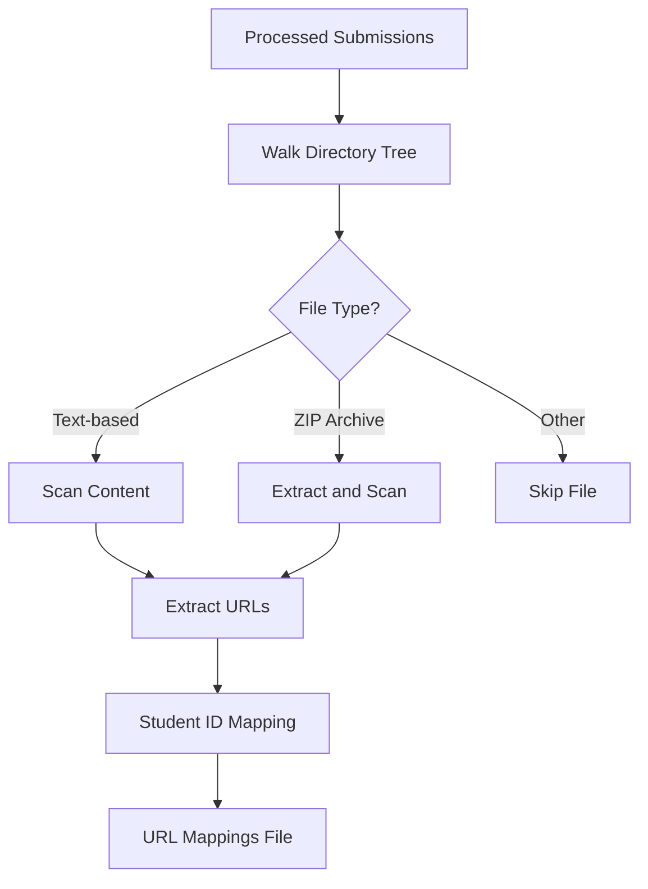

# Scan Phase - GitHub URL Discovery

The scan phase automatically detects GitHub repository URLs within student submissions, creating mappings between student IDs and their repositories.

## Overview

The scan command searches through processed submissions to find GitHub repository URLs using comprehensive pattern matching and multi-encoding support.

## Core Functions

### 1. URL Pattern Detection
MarkMate uses sophisticated regex patterns to identify GitHub URLs in various formats.

**Supported URL Formats**:
```
# Standard HTTPS URLs
https://github.com/username/repository
https://github.com/username/repository.git

# HTTP URLs (automatically converted to HTTPS)
http://github.com/username/repository

# Git clone URLs
git@github.com:username/repository.git

# URLs without protocol
github.com/username/repository

# Markdown link format
[Project Link](https://github.com/username/repository)

# Quoted URLs
"https://github.com/username/repository"
'https://github.com/username/repository'
```

### 2. File Type Scanning
Searches through multiple file types within submissions.

**Scanned File Types**:
- **Text Files**: `.txt`, `.md`, `.readme`
- **Document Files**: `.doc`, `.docx`, `.pdf`
- **Code Files**: `.py`, `.js`, `.html`, `.css`, `.json`
- **Configuration**: `.yml`, `.yaml`, `.toml`, `.ini`, `.cfg`, `.conf`
- **Archive Contents**: Files within ZIP archives

### 3. Encoding Support
Handles international student submissions with multiple text encodings.

**Supported Encodings**:
- **UTF-8**: Default modern encoding
- **UTF-16**: Windows systems with non-English locales
- **CP1252**: Windows-1252 (Western European)
- **Latin-1**: ISO-8859-1 (European systems)
- **CP1251**: Cyrillic scripts
- **Shift_JIS**: Japanese characters
- **EUC-KR**: Korean characters

## Scanning Process

### 1. File Discovery


### 2. URL Extraction and Cleaning
```python
# Example URL cleaning process
def clean_github_url(url):
    # Remove markdown formatting
    if url.startswith("[") and "](" in url:
        url = url.split("](")[1].rstrip(")")
    
    # Remove quotes
    url = url.strip("\"'")
    
    # Convert SSH to HTTPS
    if url.startswith("git@github.com:"):
        url = url.replace("git@github.com:", "https://github.com/")
    
    # Add protocol if missing
    if url.startswith("github.com"):
        url = "https://" + url
    
    # Remove .git suffix
    if url.endswith(".git"):
        url = url[:-4]
    
    return url.rstrip("/")
```

### 3. Student ID Association
Links discovered URLs to student IDs based on file location.

**Association Logic**:
```
processed_submissions/
├── 123/                    # Student ID: 123
│   ├── README.md          # Contains: github.com/student123/project
│   └── submission.pdf     # Contains: https://github.com/student123/backup
└── 456/                   # Student ID: 456
    └── project.txt        # Contains: git@github.com:user456/assignment.git

# Results in mappings:
# 123: https://github.com/student123/project (first URL found)
# 456: https://github.com/user456/assignment
```

## Output Format

### GitHub URL Mappings File
```
# MarkMate GitHub URL Mappings
# Format: student_id:github_url
# You can edit this file to add or correct URLs

123:https://github.com/student123/project-repo
456:https://github.com/user456/assignment-code
789:https://github.com/developer789/final-project

# Multiple URLs found (first one used, others commented)
# 123:https://github.com/student123/backup-repo
# 456:https://github.com/user456/old-version

# Students without URLs found
# 999:NO_URL_FOUND

# End of mappings
```

### Manual Editing Support
The output file is designed for manual correction:

1. **Add Missing URLs**: Uncomment and edit NO_URL_FOUND entries
2. **Correct URLs**: Replace incorrect URLs with correct ones
3. **Switch Primary URL**: Uncomment alternative URLs and comment primary
4. **Add New Students**: Append additional student:URL pairs

## GUI Interface

### Input Configuration
- **Submissions Folder**: Select processed submissions directory
- **Output File**: Specify mapping file location (auto-populated)
- **Encoding Selection**: Choose text encoding (dropdown with common options)

### Encoding Options
- **UTF-8 (Default)**: Standard modern encoding
- **UTF-16**: Windows international systems
- **Windows-1252**: Western European legacy
- **Latin-1**: European systems
- **Cyrillic**: Eastern European submissions
- **Japanese**: Shift_JIS encoding
- **Korean**: EUC-KR encoding

### Results Display
```
✅ Scan completed successfully!

📊 Results:
• Found 15 GitHub URLs
• 12 of 15 students have URLs
• Results saved to: github_urls.txt

You can edit the mapping file to add or correct URLs before extraction.
```

## Common Patterns and Issues

### URL Format Variations
**Students often submit URLs in various formats**:

```bash
# Common student submissions:
"My project: github.com/student/repo"
"Repository link: https://github.com/student/repo.git"
"Code at: git@github.com:student/repo.git"
"See [here](https://github.com/student/repo) for code"
```

**All automatically normalized to**:
```bash
https://github.com/student/repo
```

### Encoding Issues
**International students may use different encodings**:

```bash
# Scan with specific encoding
mark-mate scan processed_submissions/ --encoding cp1252

# GUI: Select encoding from dropdown
```

### Multiple URLs Per Student
**When multiple URLs are found**:
- First URL becomes primary
- Additional URLs are commented in output file
- Manual review and editing recommended

## Validation and Quality Control

### Post-Scan Validation Checklist
- [ ] **URL Count**: Expected number of repositories found
- [ ] **URL Validity**: URLs point to accessible repositories
- [ ] **Student Coverage**: Most students have associated URLs
- [ ] **Format Consistency**: All URLs properly formatted
- [ ] **Manual Corrections**: Review and edit as needed

### Common Validation Issues

#### Issue: Low URL Discovery Rate
**Symptoms**: Many students showing NO_URL_FOUND
**Solutions**:
1. Try different encodings
2. Check file types being scanned
3. Review submission instructions
4. Manually add known URLs

#### Issue: Invalid URLs
**Symptoms**: URLs point to non-existent repositories
**Solutions**:
1. Verify repository accessibility
2. Check for typos in student submissions
3. Contact students for corrections
4. Use alternative repository URLs

#### Issue: Encoding Problems
**Symptoms**: Garbled text in scan results
**Solutions**:
1. Try UTF-16 for Windows submissions
2. Use CP1252 for Western European students
3. Contact international students for encoding info

## Advanced Features

### Batch Processing
```bash
# Process multiple submission batches
for batch in batch_*; do
    mark-mate scan "$batch" --output "${batch}_urls.txt"
done
```

### Custom Patterns
For specialized URL patterns, the code can be extended:

```python
# Additional patterns can be added to the regex list
custom_patterns = [
    r"project\.link/[a-zA-Z0-9._-]+/[a-zA-Z0-9._-]+",
    r"git\.university\.edu/[a-zA-Z0-9._-]+/[a-zA-Z0-9._-]+"
]
```

### Integration with Version Control
```bash
# Validate URLs before extraction
while IFS=: read -r student_id url; do
    if git ls-remote "$url" &>/dev/null; then
        echo "✓ $student_id: $url accessible"
    else
        echo "✗ $student_id: $url not accessible"
    fi
done < github_urls.txt
```

## Performance Considerations

### Optimization Tips
- **Large Batches**: Process in smaller chunks for better memory usage
- **Network Validation**: Validate URLs separately to avoid scan delays
- **Encoding Detection**: Start with UTF-8, then try alternatives

### Scale Limitations
- **File Count**: No practical limit on files scanned
- **Archive Size**: Limited by available memory for ZIP extraction
- **Text File Size**: Efficiently handles files up to several MB

## Next Steps

After successful URL scanning:

1. **Manual Review**: Edit the mapping file to correct URLs
2. **Validation**: Test repository accessibility
3. **[Extract Phase](extract.md)**: Use URLs for repository analysis
4. **Alternative**: Skip to extraction without GitHub integration

## CLI Reference

```bash
mark-mate scan [OPTIONS] SUBMISSIONS_FOLDER

Options:
  --output TEXT         Output file for URL mappings (default: github_urls.txt)
  --encoding TEXT       Text encoding (default: utf-8)
  --help                Show this message and exit
```

## Example Workflows

### Standard Workflow
```bash
# 1. Consolidate submissions
mark-mate consolidate raw_submissions/

# 2. Scan for URLs
mark-mate scan processed_submissions/

# 3. Review and edit URLs
nano github_urls.txt

# 4. Proceed to extraction
mark-mate extract processed_submissions/ --github-urls github_urls.txt
```

### International Student Support
```bash
# Try multiple encodings for international submissions
mark-mate scan processed_submissions/ --encoding utf-16 --output urls_utf16.txt
mark-mate scan processed_submissions/ --encoding cp1252 --output urls_cp1252.txt

# Compare results and merge best findings
```

---

**Related Documentation**:
- [Consolidate Phase](consolidate.md)
- [Extract Phase](extract.md)
- [International Student Support](../examples/international.md)